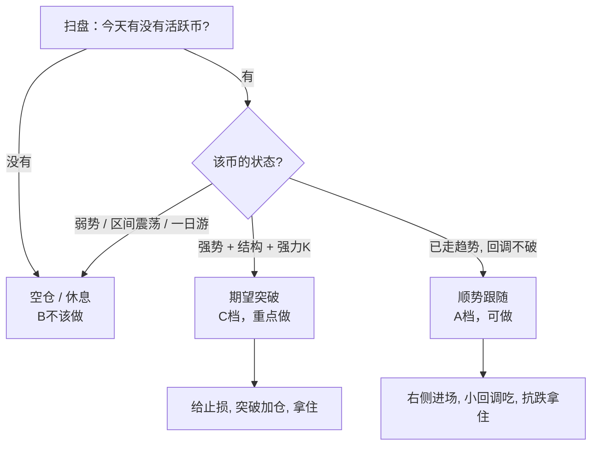

# 交易规则与方法（订单复盘体系）

> 本文由 `8.24-8.29/日记.md`、`8.30/复盘.md`、`8.31/复盘.md`、`9.1/复盘.md`、`9.12-9.20/复盘.md` 及 `A订单 / B不该做 / C期望突破` 各图表批注提炼而成。
> 核心一句话：**只做强势、只做确定性、只在关键位置在场；不犯病就是指数级复利。**

---

## 一、核心理念

| 原则             | 含义                                                                 |
| ---------------- | -------------------------------------------------------------------- |
| **强者恒强**     | 强势不是一次强，是波浪推动式的强。有强烈感觉（资金持续介入）就是买点 |
| **只做确定性**   | 盯着一个活跃币去感受速度，错过就错过，当刷经验                       |
| **转强一次成型** | 由弱转强往往是快速、一次到位的，不给犹豫的机会                       |
| **少做少看**     | 弱势、区间、无动向 = 不确定。不确定就不做，不去空就已经是赚          |
| **盈利靠大赢单** | 收益来自少数几次趋势单，不是靠开单数量                               |

> 反面案例：`B不该做/UB.png` ——「纯意淫，想吃个大的」；`prom.png` ——「区间就不要玩」。

---

## 二、行情分类与对策（A / B / C 三档）



### A 档 · 顺势单（可以做）

- 强势币回调不破，右侧进场。
- 「强势反弹，小回调可以吃」——不要等深回调，深回调往往直接走了。
- 关键：**给足止损**。上升趋势里止损给太小 = 被反复扫。
  > 反例 `magma(吐血).png`：「不断攀升三次止损，止损还是小了，应该上升趋势给点止损」。
- 典型标的：`bless`、`huma`、`magma`、`龙虾`。

### B 档 · 不该做（黑名单，一票否决）

满足任意一条即放弃：

1. **弱势币种**
2. **区间 / 盘整里来回做**（「区间就不要玩」）
3. **无任何动向就去开单**（尤其逆势去空）
4. **一天游的币**（拉一下就死）
5. **心态出问题时开的单**

> 反例清单：`chip.png`（1.弱势 2.心态出问题）、`robo.png`（1.弱势 2.突破一点 3.后续没力量 4.大概率震荡或下跌）、`us.png`（弱势币种没有强力气）、`huma.png`（方向开错：大阴线后顺势该空，却做多）。

### C 档 · 期望突破（赚大钱的主战场）

必要条件（**缺一不可**）：

1. **有盘整区 / 结构**（横盘蓄势）
2. **有强力 K**（放量强阳、吞没、快速拉升）

> 「后续还有没有力量」不用判 —— 那是预测，当下数据看不出来。
> 当下只核结构 + 强 K 两件看得见的事；开单之后按退出条件跟着走。

> 例：`4usdt.png` 批注「下跌突破 / 有盘整区 / 有强力K」；`tac.png`「这K线一出就知道后续肯定有说法」。

---

## 三、入场规则

1. **只在强势币里找机会**，弱势一律不看（不看、不做、不想）。
2. **突破入场**：突破必须被强化（放量 + 快速），"突破都是强化"。
3. **右侧确认**：宁可右侧进，不左侧猜。（`SKR` 案例：感觉会跌但每次撑住，最好做法就是右侧、抗跌拿住）
4. **强势不追高过于离谱**：拉的太快时手慢无，追不上就放弃，不情绪化追杀。
5. **开单前必须能写出止损位**；写不出止损 = 不开。

### 短线三种走法（择一匹配行情）

- 跟随惯性（趋势中继）
- 破位打法（破位确认）
- 突破打法（盘整后放量突破）

---

## 四、止损规则

| 场景              | 止损设置                             |
| ----------------- | ------------------------------------ |
| 试探性 / 期望突破 | **小止损**，不强势立刻走             |
| 强趋势持仓        | **给够空间**，不要被小回调扫掉       |
| 做突破前          | 明确亏损上限，做好「吃损」的心理准备 |

铁律：

- **不让亏损扩大**——「没有止损就手动」是导致 `BTR` 错过 100% 行情的元凶（0.2 → 0.1 没拿住）。
- **追踪止损不能太紧**：统计显示持仓 <15min 的 53 单亏 265U，>15min 的 33 单赚 604U —— 问题**在出场不在进场**。
- **止损宁可给在结构外**，不要放在明显会被扫的地方。

---

## 五、出场规则

1. **动能衰竭就走**：后续没资金、走成狗屎，趁早溜。
2. **冲高/加速段离场**：垂直拉升时果断兑现，不贪最后一口。
3. **能赚尽量走**，不要相信它会一直涨。
4. **不给"看准趋势"留遗憾**：看准的方向该拿住（`BTR` 教训），但也要有明确的退出触发条件，而非临时情绪决策。
5. **绝不用情绪手动平仓**（前期亏太多 + 心态崩 → 手动砍掉 = 事后后悔）。

---

## 六、禁止清单（犯病检查）

出现以下任一情况，**立刻停止交易，离场休息**：

- ❌ 空仓就难受、只要不空仓就想开单 → **"犯病"**（曾连犯 5 次）
- ❌ 逆势去空 / 空就反弹
- ❌ 弱势币赌突破
- ❌ 区间里来回做
- ❌ 24 小时盯盘、垃圾时间里硬做
- ❌ 前期亏损后报复性加仓（心态崩 → 手动砍单 → 错过大行情）
- ❌ 犹豫不上车，却去看垃圾币（`lsk/龙虾` 眼睁睁 600% 没上）

> 记住：**「不要为傲慢放弃市场给出的答案，不要为自己的亏损而恐惧。」**

---

## 七、作息与状态管理

- **垃圾时间多休息，关键时刻必须在场**（`9.1`：24 小时在线熬到睡着，真正的行情却来了）。
- 白天下午多为震荡收割区，不必死盯。
- 心态是最大变量：**心态受损时，宁可空仓**。
- 每天只做**热烈的、行情好的**币，把行情好的加入自选/划线跟踪。

---

## 八、每日复盘 SOP

固定流程（先复行情，再看单）：

1. **过一遍行情**：今天哪些币活跃？走势是否符合 A/C 档？
2. **划线标注**：把行情好的币加入图，标出突破点与结构。
3. **分类自己的单**：逐单归入 A订单 / B不该做 / C期望突破。
4. **标注批注**：在图上写清"该不该开、该不该拿、止损对不对"。
5. **统计三件事**：单量、胜率、以及**TOP 盈利单占比**。
6. **写一条可执行的改进**（不是情绪发泄，是规则修正）。

### 复盘模板

```
日期：
今日行情定性：（火热 / 一潭死水 / 剧烈波动）
做对的单：
做错的单（不该开）：
该拿没拿住的：
止损评价：太小 / 合理 / 过宽
犯病次数：
今日结论（一句话规则）：
```

---

## 九、开单前检查清单（Checklist）

- [ ] 这个币**强势**吗？（弱势直接跳过）
- [ ] 有**盘整结构**吗？
- [ ] 有**强力 K / 放量突破**吗？
- [ ] **各周期趋势一致**吗？（做多要短中长同向；不一致要写清哪几个打架）
- [ ] 我的**止损位**写出来了吗？空间合理吗？（说清是从哪个周期的结构取的）
- [ ] 我现在**心态平稳**吗？（不稳定 → 不开）
- [ ] 这是**关键时刻**，还是在做垃圾时间？
- [ ] 若走错，我会不会**手动情绪乱平**？

> **全部通过才开单。任一不过 → 空仓。**

---

## 十、绩效基准（对照 8.22–8.29 实测）

| 指标     | 现状                          | 目标                       |
| -------- | ----------------------------- | -------------------------- |
| 单量/天  | 20–21 单（不赚）              | **13–15 单**（赚钱日的量） |
| 币种分散 | 87 单 / 36 币（一日游全亏）   | 集中在**少数强势币**       |
| 盈利结构 | TOP5 = +499，靠大赢单         | 维持**让利润奔跑**         |
| 持仓时长 | <15min 亏 265 / >15min 赚 604 | **让对单活过 15 分钟**     |
| 总盈利   | +333 U（胜率 41%）            | 提高盈亏比，而非胜率       |

---

## 十一、常见错误 → 修正对照表

| 错误         | 修正规则                     |
| ------------ | ---------------------------- |
| 弱势币赌突破 | 弱势不看、不做、不想         |
| 区间里来回做 | 区间就是不做，等突破         |
| 止损太紧被扫 | 强趋势给够空间；止损放结构外 |
| 该拿的没拿住 | 不因恐惧手动平仓，用规则出场 |
| 逆势开空     | 只做多强者，不去空           |
| 一天开太多   | 控制在 13–15 单，只做最好的  |
| 24h 盯盘     | 垃圾时间休息，关键时段在场   |
| 心态崩了硬做 | 心态受损 → 强制空仓          |
| 复盘偷懒     | 每日固定 SOP，先复盘再交易   |

---

### 最终信条

> **弱势千万不能赌突破，不去空就已经很好了。**
> **少做、少看、不确定就不做；把该做到的做好，就能实现财富的指数级复利。**
> **只有不犯病，才能实现收益指数级上涨。**
